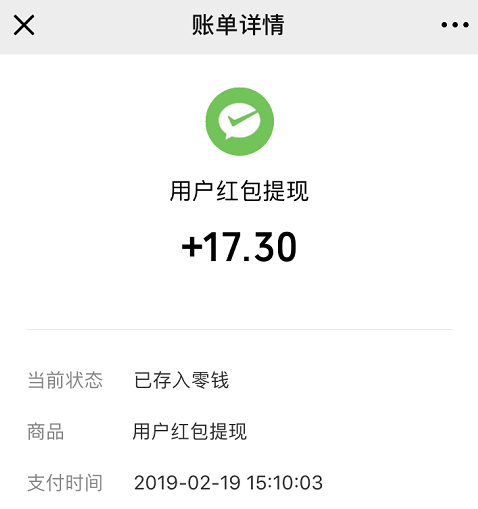

# 来赏红包助手

> 自发现至今半年以来,只有一百来个红包的平台。


## 安装
```
npm install 
```

### 使用
```
npm run serve
```

### 功能

 - 配置用户key  
 - 用户信息展示  
 - 红包列表开着玩  
 - 一键开薅
 - 多人版
 - 增删用户表
 - 定位功能 

### 原理
简单的模拟了请求参数的加密方式，然后用webpack的devServer.proxy请求平台接口。  
纯前端实现，安全监督有目共睹。