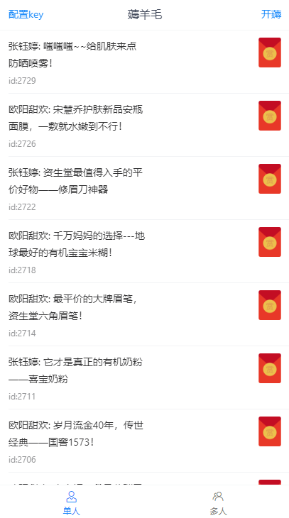
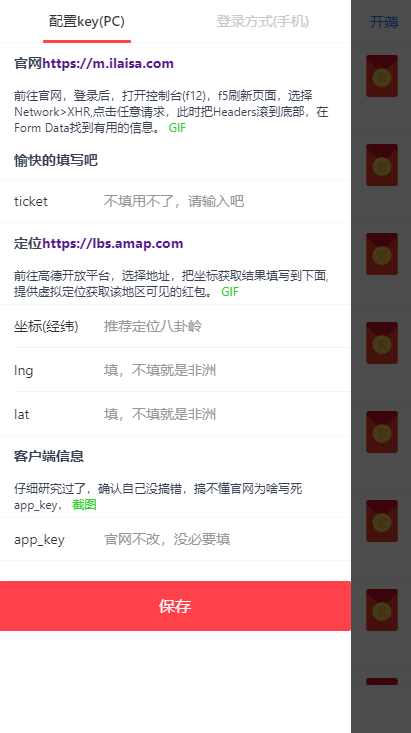
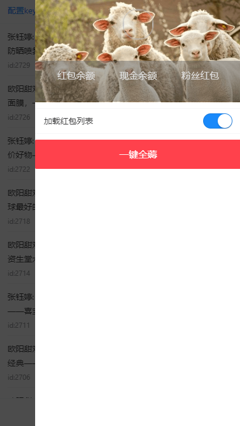
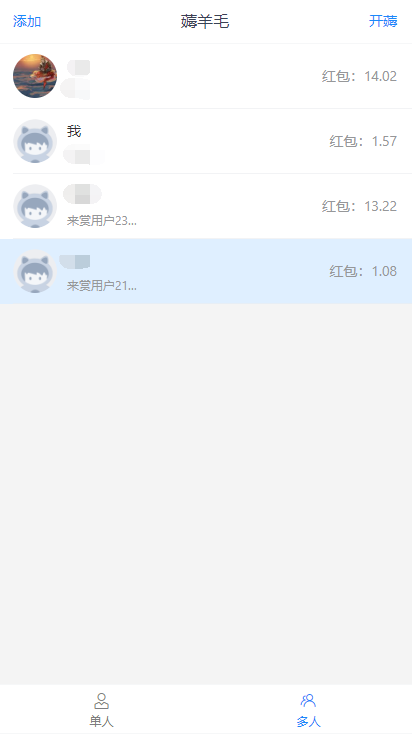

# 来赏红包助手

> 自发现至今半年以来,只有一百来个红包的平台。


## 拉取
```
git clone https://github.com/Azhjie/vue-ilaisa-assist.git
```
## 安装
```
yarn || npm install
```

### 使用
```
yarn run serve
```

### 功能

 - 配置用户key  
 - 用户信息展示  
 - 红包列表 
 - 一键开刷
 - 多人版(多号批量刷)
 - 增删用户表
 - 定位功能

### 原理
简单的模拟了请求参数的加密方式，然后用webpack的devServer.proxy请求平台接口。  
纯前端实现，安全监督有目共睹。

### 多人
列表单元格左划选择用户，以他获取的红包列表来为其他账号开红包。
列表单元格右划删除用户，暂不提供编辑功能，请删除后添加。

### 即将开发
 - 导入导出配置
 - 删除本地化配置(为一些过度设计的功能填坑，例如根据时间加载列表)


 ### 截图



